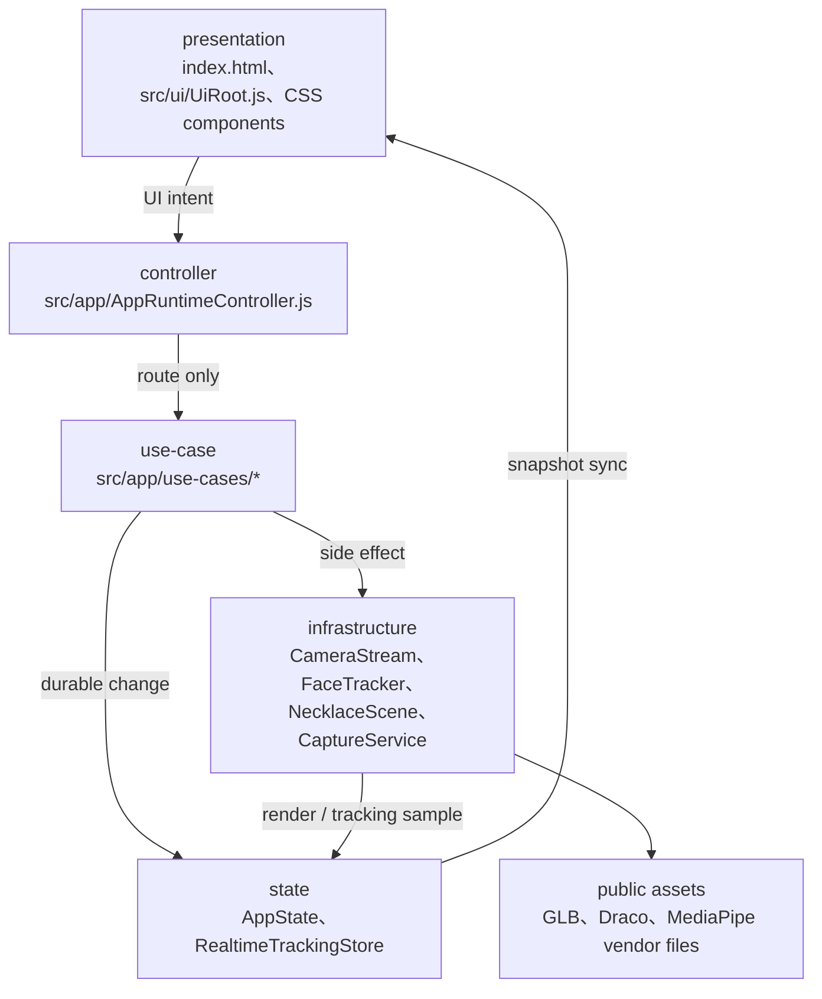
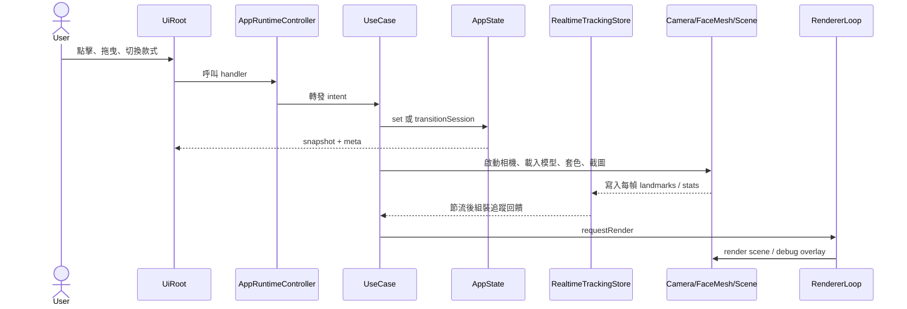

# 架構說明

本文件說明 Web AR 項鍊試戴 MVP 目前為什麼採用這樣的分層。日常協作規範請看 [CONTRIBUTING.md](./CONTRIBUTING.md)，較長期的決策脈絡請看 [ADR](./adr/)。

## 分層圖

這個專案的核心取捨是：相機、Face Mesh、WebGL、模型載入與分享都會產生副作用，但 UI 又需要非常快地回應狀態變化。分層的目的不是增加抽象，而是把「使用者做了什麼」、「狀態怎麼改」、「副作用在哪裡發生」拆開，讓日後調整相機流程、換色流程或部署安全策略時，不會從 DOM event handler 一路牽動到底層 WebGL。

## 主要資料流

`AppState` 保存 durable UI state，例如模式、session status、選取款式、換色、校準值、截圖分享狀態。`RealtimeTrackingStore` 保存每幀取樣資料，例如 Face Mesh landmarks、debug data、tracker stats 與 render stats。這兩者分開，是為了避免 Face Mesh 每幀結果觸發整個 UI 重新同步；只有需要改變 durable session 狀態或節流後更新狀態列時，use-case 才把資料推回 UI。

## 各層職責

Presentation 層負責 DOM query、event binding、狀態文字、表單控制、底部面板與可及性狀態。`UiRoot` 可以知道按鈕、色票、canvas 與面板，但不應該知道相機如何恢復、Face Mesh 如何初始化、GLB 怎麼釋放，也不應該直接修改 `AppState`。

Controller 層目前只有 `AppRuntimeController`。它的工作是保留對外 handler surface，讓 `src/main.js` 可以把 UI callback 接上來，再把事件轉發到對應 use-case。controller 不應直接執行相機、render、debug overlay、模型載入、校準儲存或狀態轉換副作用；這些副作用屬於 use-case。這個限制讓 controller 可以保持很薄，也降低新貢獻者因歷史命名而 import 到錯誤模組的風險。

Use-case 層負責應用流程：`CameraSessionUseCase` 管理啟動、停止、切換鏡頭與 Face Mesh 載入錯誤；`TrackingUseCase` 接 Face Mesh 結果並更新項鍊 transform 與追蹤回饋；`ModelUseCase` 管理款式選擇、GLB 載入與套色；`CalibrationUseCase` 管理拖曳與調參；`ShareUseCase` 管理截圖、下載與分享；`ModeUseCase` 管理模式、debug 與項鍊顯示；`StageInteractionUseCase` 區分 showcase 拖曳與 AR 校準拖曳；`RuntimeLifecycleUseCase` 管理初始化、背景暫停、恢復與預載入。Use-case 可以協調多個 service，但不應該做 DOM query，也不應該碰 Three.js geometry/material disposal 細節。

Infrastructure 層包裝外部或低階 API：`CameraStream` 包 `getUserMedia`，`FaceTracker` 包 MediaPipe Face Mesh，`NecklaceScene` 與子服務包 Three.js、GLB loader、材質客製與資源釋放，`CaptureService` 包畫面截圖。這些模組應提供明確方法與錯誤，不應反向依賴 UI，也不應上傳或保存相機影像。

## MediaPipe / FaceMesh 取捨

Face Mesh 是本 MVP 速度與可落地性的核心：它能在瀏覽器內提供單人臉部 landmarks，足以估算下巴、臉寬、臉高、roll 與簡化 yaw。缺點是它不是人體或脖子 3D 重建，因此項鍊位置是 2D landmark 推估，不保證衣領、肩頸或多人情境準確。這也是為什麼調參集中在 `src/config/tuning.js` 與 `src/config/necklaces.js`，讓模型與算法可在不重寫整個流程的前提下逐步修正。

MediaPipe runtime 資產 vendored 到 `public/vendor/mediapipe/face_mesh`，執行時不依賴 CDN。這讓 Cloudflare Pages preview、production 與 smoke test 都可以用 same-origin 路徑驗證 WASM、binarypb 與 loader 檔案，減少 CORS 與 CDN 版本漂移。代價是 bundle 之外還有大型 runtime assets，需要 release token、cache header 與 smoke test 一起管理。CSP 也必須允許 MediaPipe generated runtime 需要的 eval 行為，詳見 [0003-mediapipe-csp.md](./adr/0003-mediapipe-csp.md)。

## 暫時性妥協

目前 `UiRoot` 仍是高 DOM 噪音模組，尚未完整納入 `// @ts-check`；新的低噪音 service 或 use-case 則應優先加型別邊界。這是刻意的漸進式 TypeScript 策略，詳見 [0002-progressive-typescript.md](./adr/0002-progressive-typescript.md)。

項鍊貼合仍採單人臉部 landmarks 與啟發式估算。短期會透過 tuning、模型 pivot、depth occluder 與校準 UI 收斂；若未來要處理衣領、肩頸碰撞或多人情境，應先建立新的 domain boundary，而不是把人體重建邏輯塞進現有 controller。

相機權限、iOS Safari、真實 Face Mesh 追蹤與前後鏡頭切換無法只靠 CI 完整驗證。CI 會覆蓋 unit、typecheck、lint、visual、a11y、budget、smoke 與 Lighthouse；真機相機與效能仍需要人工驗收。部署面則以 Cloudflare Pages 為正式目標，原因與代價見 [0001-cloudflare-pages.md](./adr/0001-cloudflare-pages.md)。
